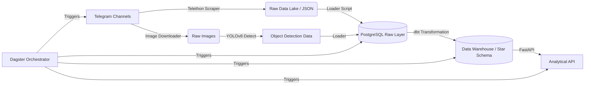

# Medical Telegram Warehouse

**An End-to-End Data Engineering Pipeline for Ethiopian Medical Business Intelligence.**

> **Status**: Active Development. Tasks 1 & 2 (Scraping, Data Warehousing) are complete. Tasks 3 (YOLO), 4 (API), and 5 (Orchestration) are in progress.

---

## 📖 Overview

**Medical Telegram Warehouse** is a robust data pipeline designed to extract, transform, and analyze data from Telegram channels involved in the Ethiopian medical and pharmaceutical market.

The goal is to answer critical business questions:
- *What are the trending medical products?*
- *How does pricing vary across channels?*
- *What is the role of visual content in engagement?*

### 🏗 Architecture

The system follows a modern **ELT (Extract, Load, Transform)** architecture with an additional Enrichment layer.



### 🛠 Tech Stack

- **Ingestion**: Python, `Telethon` (Async Telegram Client)
- **Storage**: PostgreSQL 15 (Dockerized), Local File System (Data Lake)
- **Transformation**: `dbt-core` (Data Build Tool)
- **Enrichment**: `YOLOv8` (Computer Vision / Object Detection)
- **API**: `FastAPI`, `Pydantic`
- **Orchestration**: `Dagster`
- **Infrastructure**: Docker, Docker Compose

---

## 🚀 Setup & Installation

### Prerequisites
- Docker & Docker Compose
- Python 3.10+
- Telegram API Credentials (`api_id`, `api_hash`)

### 1. Clone & Environment
```bash
git clone https://github.com/your-repo/medical-telegram-warehouse.git
cd medical-telegram-warehouse
python -m venv venv
source venv/bin/activate  # or .\venv\Scripts\activate on Windows
pip install -r requirements.txt
```

### 2. Configure Secrets
Create a `.env` file in the root directory:
```env
# Telegram Credentials
TG_API_ID=your_api_id
TG_API_HASH=your_api_hash
TG_PHONE=your_phone_number

# Database Credentials
POSTGRES_USER=postgres
POSTGRES_PASSWORD=postgres
POSTGRES_DB=medical_warehouse
POSTGRES_HOST=localhost
POSTGRES_PORT=5432
```

### 3. Start Infrastructure
Launch the PostgreSQL database:
```bash
docker-compose up -d db
```

---

## 📦 Project Modules (Tasks)

### Task 1: Data Scraping (Completed ✅)
Robust scraper engine collecting text and images from channels like *CheMed*, *Lobelia Cosmetics*, and *Tikvah Pharma*.
- **Run Scraper**: `python src/scraper.py`
- **Output**:
  - JSON logs: `data/raw/telegram_messages/`
  - Images: `data/raw/images/`
  - Execution Logs: `logs/scraper.log`

### Task 2: Data Modeling & Transformation (Completed ✅)
Transforms raw JSON into a Kimball Star Schema optimized for analytics.
- **Models**:
  - `stg_telegram_messages`: Cleaning, deduplication, type casting.
  - `dim_channels`: Channel metadata and biological stats.
  - `dim_dates`: Comprehensive date spine.
  - `fct_messages`: Central fact table with view/forward metrics.
- **Run Transformation**:
  ```bash
  # Helper script to load JSON to Postgres Raw Layer
  python scripts/load_to_postgres.py
  
  # Run dbt models (via Docker)
  docker-compose run dbt run
  ```

### Task 3: Data Enrichment (Pending 🚧)
Uses **YOLOv8** to detect objects (e.g., *medicine bottles, people, pills*) in scraped images.
- **Goal**: Classify images into categories like *Promotional*, *Product Display*, or *Lifestyle*.
- **Plan**:
  - Scan `data/raw/images/`.
  - Run inference using `yolov8n.pt`.
  - Save results to `fct_image_detections` table in the warehouse.

### Task 4: Analytical API (In Progress 🚧)
Exposes the Data Warehouse via a RESTful API.
- **Current State**: Skeleton FastAPI app (`api/main.py`).
- **Planned Endpoints**:
  - `GET /api/reports/top-products`: Trending extraction.
  - `GET /api/channels/{name}/activity`: Posting frequency analysis.
  - `GET /api/reports/visual-content`: Image classification stats.
- **Run Server**:
  ```bash
  uvicorn api.main:app --reload
  ```

### Task 5: Orchestration (Pending 🚧)
Automates the pipeline using **Dagster**.
- **Goal**: Schedule the entire flow (Scrape -> Load -> Transform -> Enrich) to run daily.
- **Components**:
  - `ops`: Atomic tasks for each pipeline step.
  - `jobs`: Defined dependencies between ops.
  - `schedules`: CRON-based triggers.

---

## 🧪 Testing

We use **pytest** for unit tests and **dbt tests** for data integrity.

```bash
# Run Unit Tests (Scraper logic)
pytest tests/

# Run Data Quality Tests (Schema & Business Logic)
docker-compose run dbt test
```

## 📂 Directory Structure

```plaintext
medical-telegram-warehouse/
├── api/                  # FastAPI Application
├── dagster/              # Orchestration (Planned)
├── data/                 # Data Lake (Raw JSON/Images)
├── medical_warehouse/    # dbt Project (Transformation)
├── notebooks/            # EDA & Analysis
├── scripts/              # Utility scripts (Loaders)
├── src/                  # Core source code (Scraper, Config)
├── tests/                # Unit Tests
├── docker-compose.yml    # Infrastructure
└── requirements.txt      # Python Dependencies
```
